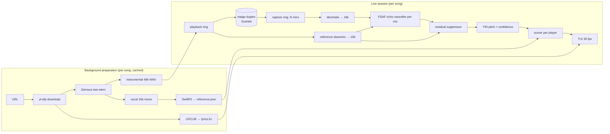
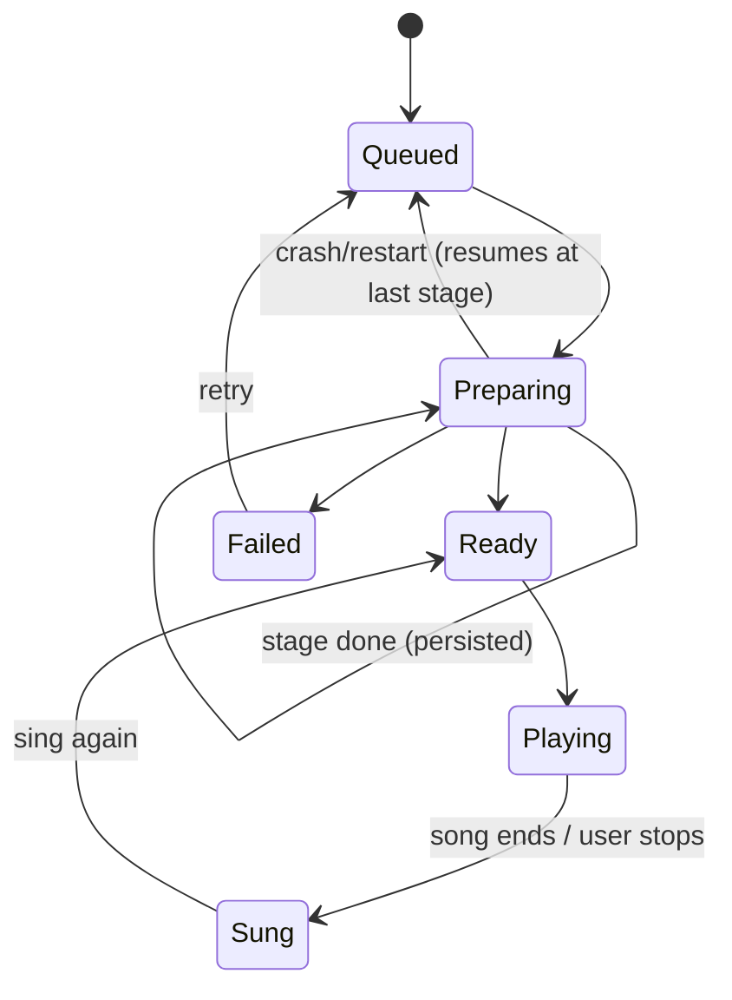
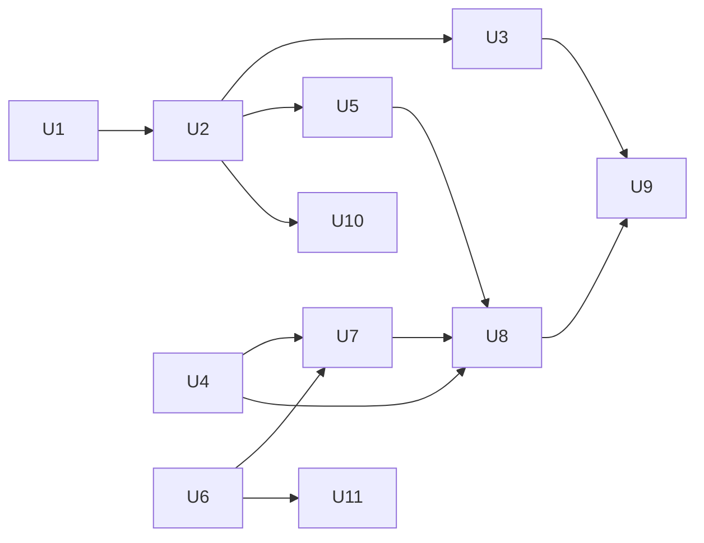

# feat: cli karaoke — YouTube karaoke with a persisted queue, echo cancellation and pitch scoring

## Summary

Add `cli karaoke`, a terminal karaoke tool. The user builds a queue of YouTube URLs. Each song is prepared in the background: download, a two-stem Demucs split, a reference pitch contour taken from the isolated vocal with SwiftF0, and synced lyrics from LRCLIB. The queue survives crashes. Pressing Enter plays the next ready song: the instrumental goes out of the Scarlett 18i20 to the room speakers, every selected mic input is a player, and each player's pitch is scored against the original singer.

The speaker bleed is removed by a pure-Go acoustic echo canceller, fed with the exact playback signal on the same audio clock. It also removes the need to wear headphones. Songs can also be exported as UltraStar Deluxe `.txt` files. Live audio targets macOS only for now, through malgo (cgo, CoreAudio). The macOS release binaries are built with cgo, and the Linux and Windows binaries stay pure Go without live audio.

---

## Problem Frame

The toolbox already turns a YouTube URL into practice stems for drums (`cli dtx`). It downloads with yt-dlp, separates with Demucs, and provisions its Python tooling in a uv-managed venv. The user wants the same "paste a link, get something playable" experience for singing, used socially in a room. Several people sing into the interface mics while everyone hears the backing track on speakers. The score should reflect whether each singer actually stayed in tune.

Nothing in the repo opens an audio device today: live audio is REAPER's job. Releases are pure Go (`CGO_ENABLED=0`), and there is no CI. Live audio needs cgo, so the macOS release build has to change.

---

## Requirements

- R1. `cli karaoke` opens a TUI with a queue. The user can add YouTube URLs, remove and reorder entries, and see each entry's preparation state and progress.
- R2. The queue and each entry's state are persisted to disk as they change. After a crash, power loss or restart, reopening the tool restores the queue, and interrupted preparations resume from their last completed stage.
- R3. Each song is prepared in the background: download, vocal/instrumental separation, a reference f0 contour of the vocal with voicing, and synced lyrics from LRCLIB. Artifacts are cached per video ID, and a song is never prepared twice.
- R4. Enter plays the next ready song. The instrumental plays through a configured output pair of the audio interface, and each configured mic input is captured at the same time on one duplex stream.
- R5. Each selected mic input is a separate player, with its own live pitch indicator, running score and final result.
- R6. Speaker bleed is removed per mic by acoustic echo cancellation plus residual suppression, using the known playback signal. Quality matters more than implementation cost. With nobody singing, the backing track alone must score close to zero.
- R7. Scoring compares each player's pitch with the reference contour. It is octave-independent, has a semitone tolerance per difficulty and a timing slack of about ±100 ms, and uses a 10,000-point scale: 9,000 for notes plus 1,000 line bonus. End-of-song stats per player are shown.
- R8. A calibration step measures the playback-to-mic latency, the echo path and the noise floor per mic, and persists the result per device.
- R9. Lyrics are shown in sync (line-level, with progress through the current line).
- R10. Any prepared song can be exported as an UltraStar Deluxe `.txt` (format 1.1.0) with its audio, instrumental and vocal files.
- R11. Live karaoke works on macOS (Apple Silicon and Intel), and the macOS release artifacts include it. The Linux and Windows builds keep compiling and shipping. There, `cli karaoke` states that live audio is macOS-only for now.
- R12. All user-facing strings exist in English and Portuguese.
- R13. Lyrics are fetched at runtime and stored only in the user's local song cache. They never go into the repo, fixtures or tests; tests use synthetic placeholder text.

---

## Scope Boundaries

- Word-level lyric timing and Whisper/WhisperX alignment when LRCLIB has no match. Songs without synced lyrics still play and score, with plain lyrics or none.
- A graphical (non-terminal) interface.
- Neural echo cancellation or source separation at run time.
- Playing the YouTube video itself.
- Routing through REAPER. Karaoke opens the interface directly and does not depend on the studio tool.
- Golden notes, rap and freestyle notes in scoring. These exist only as UltraStar export concepts, and the export writes normal notes.
- Live audio on Linux and Windows.

### Deferred to Follow-Up Work

- A WebRTC AEC3 backend behind the same canceller interface, if field recordings show the pure-Go canceller falls short (see Alternative Approaches).
- Whisper-based lyric alignment for songs LRCLIB does not have.
- Linux and Windows live audio. The audio backend interface and the pure-Go DSP already allow it. It needs:
  - a native CI build matrix, because GoReleaser OSS cannot merge cgo builds from several hosts;
  - handling of WASAPI's input-channel limits;
  - `%APPDATA%`-aware paths.

---

## Context & Research

### Relevant Code and Patterns

- `internal/cli/root.go`: `newRootCmd` registers tools, `env` carries config, `flagToConfigKey` maps flags. `internal/cli/launcher.go`: the `tools(e)` list, cross-checked by `launcher_test.go`.
- `internal/cli/dtx.go`, `prep.go`, `doctor.go`, `deps.go`: the command group shape (`<tool> [url]`, a `doctor` subcommand, and `ensureTools` with a confirm before the heavy install).
- `internal/pipeline/pipeline.go`: `Pipeline.Run(ctx, Request, Observer)`, stage `Event`s, and reuse of existing artifacts as the resume cache. `slug(title)-videoID` dirs.
- `internal/ui/progress.go`, `styles.go`: a bubbletea progress model fed by a buffered event channel, plus shared styles. The karaoke queue needs its own model but should reuse the styles.
- `internal/youtube`: `Client.Inspect` and `Client.Download`, reusable as-is.
- `internal/separate`: `Separator.Separate`. It has no `--two-stems` option, and the cache is keyed only by the model dir.
- `internal/deps/deps.go`: the managed venv (`VenvDir`, `venvBin`, the `install` closure, `undeclaredDeps`), the `Checker` and `Status` report, and brew-only hints.
- `internal/audio`: an ffmpeg-subprocess `Converter`. There is no in-process PCM decoding.
- `internal/runner` and `internal/runnertest`: every external tool goes through `runner.Runner`, and tests use `runnertest.Fake`, with `Do` writing the files a real tool would.
- `internal/studio/topology.go`: the Scarlett inputs (mic1 = input 1, mic2 = input 2, `KindVocal`) and outputs (main = 1/2), readable via `InstrumentsOfKind(KindVocal)` and `OutputPair`.
- `internal/studio/store.go`: YAML persistence with plain, non-atomic `os.WriteFile`. The queue store should mirror its API but write atomically.
- `internal/config`: per-tool viper sections, the `CLI_` env prefix, `Load` via `v.Get*`, and `validator` tags.
- `internal/i18n`: `en` and `pt` maps, with tests enforcing key and placeholder parity.
- `.goreleaser.yaml`: `CGO_ENABLED=0`, six OS/arch targets, no CI in the repo.
- Conventions: stdlib `testing` with descriptive sentence test names, `t.TempDir` and `t.Setenv` isolation, no golden files, `make test` with `-race`, and commit subjects in plain imperative sentences.

### Institutional Learnings

- No `docs/solutions/` or prior plans exist in this repo.

### External References

- malgo v0.11.26 (Unlicense): duplex device type, `DeviceConfig.Playback` and `Capture` `SubConfig` with `DeviceID`, `Channels` and `ShareMode`, `ctx.Devices()`, and interleaved byte callbacks. It has no channel-picking API, so the callback deinterleaves. It needs cgo, with no extra linking on macOS/Windows and `-ldl` on Linux. https://pkg.go.dev/github.com/gen2brain/malgo
- miniaudio has no ASIO backend. On Windows, WASAPI shared mode may expose fewer inputs than the device has. https://github.com/mackron/miniaudio
- SwiftF0 0.3.0 (MIT): 16 kHz input, a 16 ms hop, and a `PitchResult` with timestamps, `pitch_hz`, confidence (voiced at ≥ 0.5) and `loudness_db`. It reports any pitched sound, so Demucs residue needs gating. https://pypi.org/project/swift-f0/ and https://github.com/lars76/swift-f0
- RMVPE: a vocal-pitch estimator for polyphonic music, the fallback candidate. https://arxiv.org/abs/2306.15412
- LRCLIB: `GET /api/get` (track, artist, album, duration within about ±2 s), `/api/search`, `syncedLyrics` in LRC form, and an `instrumental` flag. A User-Agent is recommended. https://lrclib.net/api
- UltraStar format 1.1.0: UTF-8 without BOM, mandatory `#VERSION`, `#TITLE`, `#ARTIST`, `#AUDIO` and `#BPM`, plus `#INSTRUMENTAL` and `#VOCALS`. Note lines are `: start length pitch text`, pitch 0 = C4 = MIDI 60, and the file ends with `E`. https://usdx.eu/format/
- USDX scoring (`src/base/UNote.pas`): tolerance `2 − level` semitones on rounded tones, octave folding to within ±6, and 9,000 note points plus 1,000 line bonus. The line-bonus formula was not verified. https://github.com/UltraStar-Deluxe/USDX
- Echo cancellation references: Valin, "On Adjusting the Learning Rate in Frequency Domain Echo Cancellation With Double-Talk" (SpeexDSP MDF, `mdf.c`), the frequency-domain Kalman filter (Enzner & Vary, Kuech et al.), GCC-PHAT delay estimation, and the WebRTC AEC3 Go binding in LiveKit `pkg/apm`, noted as an alternative.
- yt-dlp needs a JS runtime for YouTube since 2025.11 (Deno ≥ 2.3 by default). https://github.com/yt-dlp/yt-dlp/wiki/EJS
- GoReleaser split/merge is Pro-only. A native GitHub Actions matrix is the OSS path for cgo builds. https://goreleaser.com/customization/partial/

---

## Key Technical Decisions

- **Pure-Go echo canceller, behind an interface.** It is a partitioned-block frequency-domain adaptive filter with MDF-style learning-rate control, one per mic, fed a mono downmix of the playback reference. It is followed by a reference-driven residual echo suppressor (Wiener-style, per frequency bin) and pitch-confidence gating. Rationale:
  - AEC3 is speech-tuned, and its nonlinear suppressor is known to duck harmonics, which is exactly what the pitch detector needs.
  - AEC3 adds a vendored C++ build on top of malgo's C, and that cost grows once other OSes are added.
  - A pure-Go canceller is fully testable with synthetic room impulse responses and measurable ERLE.
  - The shared duplex clock removes the hardest AEC problem (delay drift).
  - The interface keeps AEC3 as a drop-in follow-up if field recordings demand it.
- **Process the live signal chain at 16 kHz.** Capture and reference are decimated from the device rate (48 kHz preferred) to 16 kHz before echo cancellation and pitch detection. Sung f0 is below about 1.1 kHz, this cuts the echo canceller's CPU cost by about 3× for four mics, and it matches SwiftF0's rate, so the reference and live pitch share a time base.
- **The calibration sweep doubles as the echo-path seed.** An exponential sine sweep played through the speakers gives, per mic, the round-trip delay (via GCC-PHAT), an initial impulse-response estimate that seeds the adaptive filter, and the echo tail length that sizes it. A few seconds of music then measure the residual floor used for gating. This is persisted per device and output pair.
- **Score against the reference contour, not against segmented notes.** The reference and the singer are compared per 10 ms frame. The continuous equivalent of USDX's rounded-tone rule is |Δ| ≤ tolerance + 0.5 semitone (Easy 2.5, Medium 1.5, Hard 0.5), with octave folding. The timing slack means the best singer frame within ±100 ms, after latency compensation. 9,000 points are spread over the voiced reference frames. 1,000 points of line bonus are spread over the LRC lines, each scaled by the line's hit ratio. That line-bonus formula is our own, since USDX's was not verified. Note segmentation exists only for the UltraStar export.
- **SwiftF0 in the managed venv, run as a batch step.** SwiftF0 is MIT, light and 16 kHz. A small Python script shipped in the binary is run through `runner.Runner` and writes the contour as JSON, so no long-lived process or stdin support is needed. Voicing is gated by confidence, by `loudness_db` and by the Demucs vocal-stem RMS, to suppress instrument residue. A second extractor (RMVPE) fits behind the same interface if SwiftF0 is noisy on separated vocals.
- **Live pitch detection is YIN, written in Go.** Windows of about 64 ms at 16 kHz, with a 10 ms hop. It has no dependency, it is deterministic, and it gives an aperiodicity value that serves as the confidence gate.
- **The audio backend sits behind an interface, and malgo is behind a `darwin && cgo` build tag.**
  - Everything else in karaoke is portable Go or shells out: preparation, the queue, the DSP, scoring and export.
  - Linux, Windows and `CGO_ENABLED=0` builds compile a stub backend. There `cli karaoke` can still build the queue, prepare songs and export, and says that singing needs the macOS build.
  - Tests use a deterministic fake backend that plays scripted capture buffers, so the whole suite runs on any OS.
- **Keep the real-time callback minimal.** The malgo callback only copies frames into lock-free ring buffers and pulls playback from a preloaded buffer. Decimation, echo cancellation, pitch detection and scoring run on a separate goroutine per stream. The TUI reads snapshots at about 30 fps.
- **Playback audio is decoded offline by ffmpeg.** Preparation renders the instrumental to a 48 kHz float WAV, and the vocal and reference downmix to 16 kHz mono. The live path reads WAV in Go, so there is no in-process decoder dependency.
- **The queue is persisted as a JSON file with atomic writes.** The whole queue is written on every state change, to a temp file then renamed (with a file sync), under the per-OS state dir. Entries hold the URL, video ID, title, state, last completed stage, error, and scores per session. The song artifacts on disk remain the source of truth for resuming.
- **One background preparation worker.** Songs are prepared one at a time in queue order. Demucs saturates the CPU/GPU, and parallel runs would starve the live audio. Preparation keeps running while a song plays, and each preparation job runs at lower OS priority to protect the audio thread.
- **Existing paths.** Karaoke follows the repo's current layout: config under `~/.config/cli`, data under the XDG data dir. The queue and calibration go in a `karaoke` state dir beside it, and songs go in a configurable songs dir. No new paths abstraction is added for macOS-only work.
- **Releases stay on GoReleaser OSS, run on a Mac.** The single build splits into two:
  - darwin amd64/arm64 with `CGO_ENABLED=1`, which clang on macOS builds natively for both architectures;
  - linux and windows with `CGO_ENABLED=0`, cross-compiled as today.

  Releasing therefore requires a macOS host, which is how releases are already cut (`make snapshot` locally). No CI matrix is needed yet.
- **Two-stem separation is keyed by mode.** `separate.Options` gains a two-stem option, and the output dir name includes the mode. This prevents a cached 4-stem dir from satisfying a two-stem request, and vice versa.
- **The dependency report grows.** Deno joins the report as a required tool for YouTube downloads, with a brew hint like the others, and swift-f0 joins as a managed one.

---

## Open Questions

### Resolved During Planning

- Is UltraStar Deluxe free? Yes, it is GPL and cross-platform. Export is in scope.
- Headphones or speakers? Speakers. Echo cancellation is in scope and must be done well.
- One score or one per mic? One player per mic.
- AEC3, SpeexDSP or pure Go? Pure Go behind an interface (see Key Technical Decisions). SpeexDSP was rejected: it is speech-tuned, mono per state, gives the least control over music, and would still add a C wrapper.
- Which platforms? macOS only for now. Linux and Windows keep shipping without live audio.
- How to release cgo binaries without GoReleaser Pro? Only darwin needs cgo, and GoReleaser OSS on a Mac builds it natively while cross-compiling the pure-Go targets.
- Does the queue survive crashes? Yes: JSON with atomic writes plus artifact-based stage resume.

### Deferred to Implementation

- Whether CoreAudio exposes all 18 Scarlett inputs to one malgo duplex stream on this machine, and at what period size. Confirm on hardware.
- Coexistence with REAPER using the interface at the same time. CoreAudio allows sharing, but a sample-rate mismatch between the two apps would force a switch. Karaoke should adopt the device's current rate rather than change it.
- The exact SwiftF0 constructor parameters (fmin/fmax, threshold) and whether its `segment_notes()` beats our Go segmentation for the export. Decide after reading `swift_f0/core.py`.
- The UltraStar BPM/beat conversion factor. The spec and the USDX parser state the ×4 differently. Verify by loading an exported file in USDX and checking alignment.
- Echo-canceller tuning constants (partition size, step control, suppressor over-subtraction). Tuned against real recordings from the replay harness (U8).
- Whether GoReleaser needs explicit `CC`/`CGO_CFLAGS` (`-arch`) per darwin arch, or whether the Xcode clang defaults are enough when `GOARCH` differs from the host.
- macOS microphone permission: the prompt is attributed to the terminal app. Confirm the error surfaced when permission is denied (malgo delivers silence versus failing).
- The LRCLIB `/api/get` parameter optionality (sources conflict). Implement `/get` with a `/search` fallback and match on duration.

---

## Output Structure

    internal/
    ├── karaoke/
    │   ├── song/              # song artifacts, preparation stages, cache/resume
    │   ├── queue/             # persisted queue store + background worker
    │   ├── lyrics/            # LRCLIB client + LRC parser
    │   ├── reference/         # f0 contour format + SwiftF0 extractor (embedded script)
    │   ├── dsp/               # resampler, YIN, GCC-PHAT, sweep, echo canceller, suppressor
    │   ├── score/             # scoring engine + stats
    │   ├── audioio/           # backend interface, malgo backend (darwin+cgo), stub, fake backend
    │   ├── calibrate/         # sweep calibration + per-device persistence
    │   ├── live/              # real-time session engine + recording/replay harness
    │   └── ultrastar/         # note segmentation + .txt writer
    └── cli/
        ├── karaoke.go         # command group: karaoke, doctor, export, calibrate
        └── karaoketui.go      # queue / sing / results models

---

## High-Level Technical Design

> *This illustrates the intended approach and is directional guidance for review, not implementation specification. The implementing agent should treat it as context, not code to reproduce.*

Queue entry lifecycle:

---

## Implementation Units

### Phase A: Foundations

### U1. Dependency checks and two-stem separation

**Goal:** Extend the dependency report and the managed venv, and support two-stem Demucs output with a mode-keyed cache.

**Requirements:** R3, R12

**Dependencies:** None

**Files:**
- Modify: `internal/deps/deps.go`, `internal/deps/deps_test.go`, `internal/separate/separate.go`, `internal/separate/separate_test.go`, `internal/i18n/en.go`, `internal/i18n/pt.go`

**Approach:**
- The managed venv install also installs `swift-f0`. A `swiftf0Status` probe mirrors `demucsVersion`.
- Deno joins the report as required for downloads, with a brew hint.
- `separate.Options` gains a two-stem option, which is passed as `--two-stems` and included in the output dir name.

**Patterns to follow:** `demucsStatus` and `demucsVersion`, `InstallDemucs`, `TestVenvPathsAreScopedToTheDataDir`.

**Test scenarios:**
- Happy path: install runs `uv pip install` for demucs, then swift-f0, then verifies both.
- Happy path: a two-stem request passes `--two-stems vocals` and returns the `vocals` and `no_vocals` stems.
- Edge case: an existing 4-stem cache dir does not satisfy a two-stem request, and the reverse also holds.
- Error path: swift-f0 install failure reports its own error without removing a working demucs.
- Edge case: missing deno is reported as required, with its install hint, and a present deno shows its version.

**Verification:** The existing dtx tests pass unchanged, and the report lists deno and swift-f0.

---

### U2. Song preparation pipeline

**Goal:** Turn a URL into a cached, resumable song directory with everything a live session and an export need.

**Requirements:** R3, R9, R13

**Dependencies:** U1

**Files:**
- Create: `internal/karaoke/song/song.go`, `internal/karaoke/song/prepare.go`, `internal/karaoke/song/song_test.go`, `internal/karaoke/song/prepare_test.go`
- Create: `internal/karaoke/reference/reference.go`, `internal/karaoke/reference/swiftf0.go`, `internal/karaoke/reference/swiftf0.py` (embedded), `internal/karaoke/reference/reference_test.go`
- Create: `internal/karaoke/lyrics/lrclib.go`, `internal/karaoke/lyrics/lrc.go`, `internal/karaoke/lyrics/lrclib_test.go`, `internal/karaoke/lyrics/lrc_test.go`

**Approach:**
- The stages are Inspect, Download, Separate (two-stem), Render, Reference and Lyrics.
- Render uses the audio `Converter`/ffmpeg to write the instrumental at 48 kHz float stereo and the vocal at 16 kHz mono.
- Reference runs the embedded script with the venv python. The script writes JSON with the hop, time, Hz, confidence and loudness. Go then applies voicing gates.
- Lyrics: LRCLIB `/get` by title, artist and duration, with a `/search` fallback and a duration match. The result is saved as `lyrics.lrc` in the song dir.
- A `song.json` manifest in the song dir records the metadata and the completed stages. Each stage is skipped when its artifact and manifest entry both exist.
- Events reuse the `pipeline.Event` shape, so progress can feed the UI.
- The song dir is `<karaoke data dir>/songs/<slug>-<videoID>/`.

**Patterns to follow:** `internal/pipeline/pipeline.go` (stages, `emit`, reuse), `runnertest.Fake` `Do` handlers, `httptest.Server` for LRCLIB.

**Test scenarios:**
- Happy path: a fresh URL runs all stages in order and writes the manifest, instrumental, vocal, reference and lyrics.
- Happy path: a rerun with a complete manifest runs no external command.
- Edge case: a crash after Separate means the rerun starts at Render, and download and Demucs are not called.
- Edge case: when LRCLIB returns 404 on `/get`, `/search` picks the candidate within ±2 s of the duration.
- Edge case: when LRCLIB marks the song instrumental or no synced lyrics exist, the song is still Ready, flagged no-lyrics.
- Edge case: LRC parsing handles multiple timestamps per line, `[offset:]`, blank lines and unsorted lines. All fixtures use synthetic placeholder words.
- Error path: when the reference script exits non-zero, the stage fails with the script tail, and earlier stages stay cached.
- Happy path: the voicing gate drops frames below the confidence threshold or with a low stem RMS.
- Integration: the manifest written by one run is read back identically, including time units.

**Verification:** A prepared song dir contains everything needed to play and export offline.

---

### U3. Persisted queue and background worker

**Goal:** A durable queue that restores after a crash and prepares songs one at a time in the background.

**Requirements:** R1, R2, R3

**Dependencies:** U2

**Files:**
- Create: `internal/karaoke/queue/store.go`, `internal/karaoke/queue/worker.go`, `internal/karaoke/queue/store_test.go`, `internal/karaoke/queue/worker_test.go`

**Approach:**
- Store: load, and mutations (add, remove, move, set state, record score), each followed by an atomic save (temp file in the same dir, sync, rename). The store lives in the karaoke state dir.
- Duplicate URLs or video IDs are rejected with a pointer to the existing entry.
- On load, entries in Preparing return to Queued, and the worker resumes them through the song manifest.
- Worker: one goroutine takes the first Queued entry, runs `song.Prepare` with cancellation, and publishes events on a channel for the TUI.
- A corrupt queue file is moved aside (`queue.json.corrupt-<timestamp>`) and an empty queue starts, with a warning. The user's queue is not silently lost.

**Patterns to follow:** the `internal/studio/store.go` API shape, improved with atomic writes.

**Test scenarios:**
- Happy path: adding, moving, removing and reloading gives an identical queue.
- Edge case: a simulated crash mid-write (a temp file left behind) loads the previous complete file.
- Edge case: a Preparing entry becomes Queued on reload, and the worker resumes it.
- Edge case: adding the same video under a different URL form is rejected as a duplicate.
- Error path: a corrupt JSON file is renamed aside and an empty queue loads with a warning event.
- Happy path: the worker prepares entries serially and in order. A failure marks that entry Failed and continues with the next.
- Happy path: cancelling during preparation leaves the entry Queued with its stage progress intact.
- Integration: adding a URL while the worker is busy appends it without disturbing the running job (race detector clean).

**Verification:** Killing the process at any point and reopening restores the queue with no duplicated work.

---

### Phase B: Signal processing and scoring (pure Go, no device)

### U4. DSP core: resampling, pitch, delay, echo cancellation, suppression

**Goal:** The pure-Go signal chain that turns a raw mic plus the known playback into a clean pitch track.

**Requirements:** R5, R6, R8

**Dependencies:** None (can proceed in parallel with Phase A)

**Files:**
- Create: `internal/karaoke/dsp/resample.go`, `yin.go`, `gccphat.go`, `sweep.go`, `fdaf.go`, `suppress.go`, `gate.go`
- Test: `internal/karaoke/dsp/resample_test.go`, `yin_test.go`, `gccphat_test.go`, `sweep_test.go`, `fdaf_test.go`, `suppress_test.go`, `gate_test.go`, `roomsim_test.go` (synthetic room helper)

**Approach:**
- **Resampler:** a polyphase windowed-sinc decimator from 48 kHz or 44.1 kHz to 16 kHz.
- **YIN:** cumulative mean normalized difference with parabolic interpolation. It returns f0 and aperiodicity.
- **GCC-PHAT:** delay between reference and mic, with sub-sample refinement.
- **Sweep:** an exponential sine sweep and its inverse filter, for impulse-response measurement.
- **FDAF:** a partitioned-block frequency-domain adaptive filter.
  - The filter length is set from the calibrated tail, up to about 500 ms.
  - It uses MDF-style adaptive step control for double-talk robustness, and can be seeded from the calibration IR.
- **Suppressor:** a per-bin Wiener gain from the estimated residual echo PSD (echo-estimate leakage plus the reference spectrum), with over-subtraction and a gain floor.
- **Gate:** combines the RMS over the calibrated residual floor, the YIN aperiodicity and a check that the detected f0 is not explained by strong reference partials.
- The FFT is written in-package (radix-2, real input) to avoid a dependency. Allocation-free steady state.

**Execution note:** Test-first. Every component gets deterministic synthetic tests before tuning. A shared room simulator convolves a reference with a synthetic multi-tap IR (delay, decay tail and mild nonlinearity) and adds a sung-tone signal, so ERLE and pitch accuracy can be asserted.

**Test scenarios:**
- Happy path: YIN on pure and harmonic tones from 80 Hz to 1 kHz detects f0 within 5 cents. On vibrato (±50 cents at 5 Hz) it tracks the mean within 10 cents.
- Edge case: YIN on silence or white noise reports unvoiced (high aperiodicity). On a subharmonic-rich tone it gives no octave error on 95 % or more of frames.
- Happy path: GCC-PHAT recovers a known integer delay and a fractional one within 0.1 sample, with noise at 10 dB SNR.
- Happy path: sweep deconvolution through a known IR recovers it (correlation 0.98 or better).
- Happy path: FDAF on music-like reference plus room IR (300 ms tail) reaches 20 dB or more ERLE within 3 s of convergence. With suppression, residual plus bleed drops by 30 dB or more.
- Edge case (double talk): a sung tone added during convergence stays within 1 dB of its original level after cancellation, the filter does not diverge, and its pitch is detected.
- Edge case: an echo-path change (a new IR mid-stream) re-converges within 5 s.
- Edge case: a stereo reference downmixed to mono, with L≠R panning, still gives 12 dB or more ERLE (documents the stereo limitation).
- Happy path: the resampler passes 1 kHz with ≤ 0.1 dB error and attenuates above 7.5 kHz by 60 dB or more.
- Integration: room sim, FDAF, suppressor, gate, then YIN. With backing only (no singer), 95 % or more of frames are gated unvoiced. With a singer, 90 % or more of voiced frames are within 50 cents of the truth.
- Performance: a benchmark shows four mics at 16 kHz within 20 % of one core on the dev machine.

**Verification:** The synthetic-room integration test passes under `-race`, and the benchmarks are recorded in the test output.

---

### U5. Scoring engine

**Goal:** Turn reference and player pitch tracks into live and final scores that match the stated rules.

**Requirements:** R5, R7

**Dependencies:** U2 (reference and lyrics formats)

**Files:**
- Create: `internal/karaoke/score/score.go`, `internal/karaoke/score/stats.go`, `internal/karaoke/score/score_test.go`, `internal/karaoke/score/stats_test.go`

**Approach:**
- The reference frames give fractional MIDI. Octave folding brings each sung value within ±6 semitones of the target.
- A frame counts as a hit when some player frame within ±slack of it (after latency compensation) is within the tolerance.
- Points: 9,000 divided by the voiced reference frames, per hit. The line bonus spreads 1,000 over the LRC lines, weighted by each line's voiced duration and scaled by its hit ratio. Without lyrics, fixed 4 s windows play the part of lines.
- Difficulty: Easy, Medium and Hard, with tolerances of 2.5, 1.5 and 0.5 semitones.
- Streaming: the scorer takes player frames incrementally, and snapshots are safe to read from the UI goroutine.
- Stats per player: final score, % in tune, mean absolute cents error on hits, the tendency (sharp or flat), the best and worst lines, and the longest in-tune streak.

**Patterns to follow:** table-driven tests.

**Test scenarios:**
- Happy path: a player equal to the reference scores 10,000.
- Happy path: the reference shifted by exactly one octave scores 10,000 (octave independence).
- Edge case: a constant +1.2 semitone offset scores full on Easy and Medium and 0 on Hard.
- Edge case: a player lagging 80 ms scores full with ±100 ms slack. At 150 ms it loses most points.
- Edge case: silence scores 0. Unvoiced reference frames never award points.
- Happy path: singing only half the lines gives about 50 % of the note points and the proportional line bonus.
- Edge case: a song without lyrics uses fixed windows, and the total is still capped at 10,000.
- Happy path: the stats show a sharp tendency and the correct best line for a scripted performance.
- Integration: the live incremental final score equals the batch score over the same frames.

**Verification:** The scores are deterministic and bounded to 0–10,000 for any input (a fuzz test on random tracks).

---

### Phase C: Live audio

### U6. Audio I/O backend

**Goal:** Open one CoreAudio duplex stream on the chosen interface, play the instrumental on the chosen output pair, and deliver the chosen mic channels. Every other build compiles cleanly with a stub.

**Requirements:** R4, R11

**Dependencies:** None

**Files:**
- Create: `internal/karaoke/audioio/audioio.go` (interface, device and channel types), `malgo_darwin.go` (`//go:build darwin && cgo`), `stub.go` (`//go:build !darwin || !cgo`), `fake.go`, `ring.go`
- Test: `internal/karaoke/audioio/ring_test.go`, `fake_test.go`, `malgo_integration_test.go` (behind a build tag and an env var, hardware only)
- Modify: `go.mod` (add `github.com/gen2brain/malgo`)

**Approach:**
- List devices with their capture and playback channel counts, and open a duplex stream on one device.
- Capture channel count = the highest selected input. Playback channel count = the highest output of the chosen pair. The callback deinterleaves into per-mic single-producer/single-consumer rings, and interleaves the playback frames into the chosen pair.
- Use the device's current sample rate (48 kHz preferred, never changed, so REAPER is not disturbed) with a small period (about 5–10 ms). Report the rate and period actually granted.
- The stub backend returns a typed "live audio is macOS-only for now" error from every call. The UI shows that error instead of a device list.
- The fake backend replays scripted capture buffers in lockstep with the playback it receives, so the session and calibration are testable without hardware.
- The default channels come from the studio topology (the `KindVocal` inputs, and the main output pair), overridable in the karaoke config.

**Test scenarios:**
- Happy path: the ring buffer keeps FIFO order under concurrent producer and consumer (race clean), and reports overflow and underflow counts.
- Happy path: the fake backend delivers exactly the scripted capture, aligned with playback frame indices.
- Edge case: selected inputs 1 and 2 on an 18-channel capture deinterleave the correct channels (synthetic interleaved buffer).
- Edge case: output pair 1/2 on a 20-channel playback writes only those channels and silences the rest.
- Error path: a selected input above the device's channel count fails before opening, with a message naming the available count.
- Error path: the stub backend returns the macOS-only error from both device listing and opening.
- Integration (hardware, opt-in): the Scarlett opens duplex at its current rate, and a playback click is captured on a mic input.

**Verification:** `CGO_ENABLED=0 go build ./...` and `GOOS=linux`/`GOOS=windows` builds succeed, and the macOS cgo build passes the opt-in hardware test.

---

### U7. Calibration

**Goal:** Measure and persist, per device and output pair, the latency, echo path, tail length and residual floor of each mic.

**Requirements:** R6, R8

**Dependencies:** U4, U6

**Files:**
- Create: `internal/karaoke/calibrate/calibrate.go`, `internal/karaoke/calibrate/store.go`, `internal/karaoke/calibrate/calibrate_test.go`

**Approach:**
- Calibration plays a sweep (at a moderate level, with a warning to keep the room quiet) and records every selected mic.
- For each mic it computes the IR by deconvolution, the delay by GCC-PHAT, and the tail length by the energy decay to −40 dB.
- It then plays about 5 s of pink or music-like noise through the echo canceller seeded with that IR, and records the residual floor.
- Results are persisted as JSON keyed by device name, sample rate and output pair, in the state dir.
- A session with a stale or missing calibration prompts the user to calibrate. A mic with no measurable echo (unplugged, or muted gain) is flagged.

**Test scenarios:**
- Happy path: with the fake backend and a synthetic room, the recovered delay is within 1 ms, the tail within 20 %, and the IR correlation 0.95 or better.
- Edge case: a mic with only noise is flagged "no echo path detected" and excluded from echo cancellation seeding.
- Edge case: a calibration keyed to another device or rate is not reused.
- Error path: clipping during the sweep is detected, and the user is told to lower the gain or volume.

**Verification:** Seeded echo cancellation in U8 converges faster than unseeded, in the synthetic-room test.

---

### U8. Live session engine and replay harness

**Goal:** Run a song end to end in real time. It plays the instrumental, cancels echo per mic, detects pitch and scores each player. Optionally it records the raw inputs so a session can be replayed offline.

**Requirements:** R4, R5, R6, R7

**Dependencies:** U4, U5, U6, U7

**Files:**
- Create: `internal/karaoke/live/session.go`, `internal/karaoke/live/recorder.go`, `internal/karaoke/live/replay.go`, `internal/karaoke/live/session_test.go`, `internal/karaoke/live/replay_test.go`

**Approach:**
- The session loads the song (instrumental WAV, reference, lyrics) and the calibration, and opens the backend.
- One processing goroutine per mic drains its ring and runs decimation, echo cancellation, the suppressor, the gate, YIN and the scorer. It uses a shared reference feed decimated once.
- Player time = capture frame index − calibrated delay. This keeps scoring on the device clock, not the wall clock.
- A snapshot API (position, current line, per-player pitch, target pitch, running score and underrun counts) feeds the UI.
- Pause, resume and stop are supported. A stop saves partial scores flagged as incomplete.
- A hidden `--record` flag writes the raw multichannel capture plus reference to a WAV bundle. `cli karaoke replay` (hidden) reruns the chain offline and prints ERLE and pitch metrics, so echo-canceller tuning uses the real room.

**Test scenarios:**
- Happy path: the fake backend with a synthetic room and a scripted singer on mic 1 and silence on mic 2 gives a high score for player 1 and a score near zero (≤ 300) for player 2.
- Happy path: two scripted singers on two mics get independent scores that match their offline batch scores.
- Edge case: a capture ring overflow increments the underrun counters and scoring continues. The snapshot exposes it.
- Edge case: after pausing for 10 s and resuming, the scores ignore the paused span, and the playback and reference stay aligned.
- Happy path: stopping mid-song gives partial scores flagged incomplete.
- Integration: a recorded bundle replayed gives the same scores as the live run (determinism).

**Verification:** A full synthetic song runs faster than real time in tests. On hardware, backing-only playback in the room scores near zero.

---

### Phase D: User interface

### U9. Command, config and TUI (queue, sing, results)

**Goal:** The `cli karaoke` experience: build the queue, pick players and difficulty, press Enter to sing, see live pitch and lyrics, and get results.

**Requirements:** R1, R2, R4, R5, R7, R9, R12

**Dependencies:** U3, U8

**Files:**
- Create: `internal/cli/karaoke.go`, `internal/cli/karaoketui.go`, `internal/cli/karaoke_test.go`, `internal/cli/karaoketui_test.go`, `internal/config/karaoke.go`, `internal/config/karaoke_test.go`
- Modify: `internal/cli/root.go` (register the command, flag mapping), `internal/cli/launcher.go` (tool entry), `internal/cli/launcher_test.go`, `internal/i18n/en.go`, `internal/i18n/pt.go`, `internal/cli/config.go`/`settings.go` (expose the karaoke keys in the settings editor)

**Approach:**
- Commands:
  - `cli karaoke [url...]` opens the TUI, pre-adding any URLs given.
  - `karaoke doctor` reports tools and devices, with `--install` for the venv.
  - `karaoke calibrate` runs calibration.
  - `karaoke export <entry|url>` writes the UltraStar file.
  - `karaoke replay` is hidden.
- Config section `karaoke`: device, output pair, inputs (with player names), difficulty, slack, the songs dir and the reference extractor.
- Queue view:
  - The URL input adds entries and validates them via Inspect.
  - Each row shows its state glyph, title, stage progress and last scores.
  - Keys: reorder (shift+↑/↓), delete, retry failed, Enter to play the first ready song (or the selected one), `c` to calibrate, `e` to export.
  - The worker keeps running in the same program.
- Sing view:
  - The current and next lyric lines, with a progress highlight.
  - Per player, a horizontal pitch lane (target band versus sung dot, octave-folded), a hit flash, the running score and an input level meter.
  - A song progress bar.
  - Space pauses, Esc stops.
- Results view: a table per player with the stats, and the winner highlighted. Enter returns to the queue.
- Non-TTY or `--plain`: URLs are added and prepared with line progress, and playing requires a TTY.
- On a stub build (not macOS, or no cgo), the queue, preparation and export work. Enter and `c` show the macOS-only message.
- `ensureTools` runs before the first preparation, with the same confirm-before-install flow as dtx.

**Patterns to follow:**
- `internal/cli/dtx.go` and `prep.go` for the command and wizard.
- `internal/ui/progress.go` for event channels and cancel.
- `launcher.go`, which quits before running a tool so programs never share the terminal.
- `internal/cli/meter_test.go` for testing rendered views.

**Test scenarios:**
- Happy path: the launcher lists karaoke, and `launcher_test` cross-checks it with the registered subcommands.
- Happy path: the queue model accepts typed URLs, invalid input shows an error without adding a row, and a duplicate shows the existing row.
- Happy path: Enter with no ready song shows "nothing ready yet". With a ready song it switches to the sing view.
- Edge case: a worker event for a removed entry is ignored without panicking.
- Happy path: the pitch lane renders the target band and the sung marker at the right columns for scripted snapshots, and octave folding keeps the marker in range.
- Happy path: config loads the karaoke keys from YAML and from `CLI_KARAOKE_*` env. Invalid difficulty and inputs fail validation with friendly messages.
- Edge case: a missing calibration shows a prompt before singing.
- Integration: the i18n parity tests pass with all new keys.

**Verification:** A full flow works with the fake backend in tests (add, prepare with a fake runner, play, results), and manually on the Scarlett.

---

### Phase E: Export and release

### U10. UltraStar Deluxe export

**Goal:** Write a USDX-loadable song folder from a prepared song.

**Requirements:** R10, R13

**Dependencies:** U2

**Files:**
- Create: `internal/karaoke/ultrastar/segment.go`, `internal/karaoke/ultrastar/writer.go`, `internal/karaoke/ultrastar/segment_test.go`, `internal/karaoke/ultrastar/writer_test.go`

**Approach:**
- **Segmentation:** a median-filtered fractional MIDI contour. A note starts on voicing onset or a pitch jump of ≥ 0.7 semitone sustained for 50 ms or more. Each note's pitch is its median, rounded. Notes under 80 ms are dropped, and adjacent same-pitch notes merge across gaps under 40 ms.
- **Time grid:** a fixed high-resolution BPM, so one beat is about 10–15 ms, with GAP = 0.
- **Lyrics:** words in each LRC line are distributed across the notes inside that line's time span, weighted by note duration. Extra notes get `~` continuation syllables. Lines without notes are dropped. Phrase breaks go between LRC lines.
- **Headers:** `#VERSION:1.1.0`, `#TITLE`, `#ARTIST`, `#AUDIO`, `#INSTRUMENTAL`, `#VOCALS` and `#BPM`, in UTF-8 without BOM, ending with `E`.
- Output: the audio files are copied beside the `.txt`, into a folder named `Artist - Title`.

**Test scenarios:**
- Happy path: a synthetic stepped contour (C4, E4, G4, each 300 ms) gives three notes with pitches 0, 4 and 7 and correct start and length in beats.
- Edge case: vibrato within ±40 cents stays one note. A 1-semitone step splits.
- Edge case: short blips under 80 ms are dropped, and same-pitch notes separated by 20 ms merge.
- Happy path: the writer output parses back (a round-trip parser used only in tests) to the same notes and headers. Placeholder syllables only.
- Edge case: a song without lyrics exports notes with `~` syllables and a warning.
- Edge case: a title with characters invalid in paths gives a sanitized folder name.

**Verification:** An exported song opens and plays in sync in UltraStar Deluxe (manual check; resolves the BPM-factor question).

---

### U11. Release build with cgo for macOS

**Goal:** Ship macOS binaries with live audio while Linux and Windows keep their pure-Go builds, all from one GoReleaser OSS run on a Mac.

**Requirements:** R11

**Dependencies:** U6

**Files:**
- Modify: `.goreleaser.yaml`, `Makefile`, `README.md`

**Approach:**
- `.goreleaser.yaml` changes:
  - Split the single build into `cli-darwin` (`CGO_ENABLED=1`, darwin amd64 and arm64) and `cli` (`CGO_ENABLED=0`, linux and windows amd64 and arm64).
  - Keep the same binary name, archives and ldflags.
  - Add a guard hook that fails fast when the release is not run on darwin.
  - Extend the release footer with karaoke's needs: deno, uv, the microphone permission for the terminal app, and a note that Linux and Windows builds do not sing yet.
- Makefile: `make build` is unchanged (cgo is on by default on a Mac). A `build-nocgo` target and a lint step compile with `CGO_ENABLED=0` and with `GOOS=linux`, so the stub path never rots.
- `go install` on a Mac with Xcode command-line tools gets live audio. Everything else gets the stub.

**Test expectation:** none, because this is build config. It is verified by `make snapshot` producing all six archives, with the darwin binaries linking CoreAudio (`otool -L`) and the others statically built.

**Verification:** `make snapshot` on the Mac succeeds. The darwin arm64 binary lists the Scarlett in `cli karaoke doctor`, and the linux binary's `cli karaoke doctor` prints the macOS-only notice.

---

## System-Wide Impact

- **Interaction graph:**
  - The root command gains the `karaoke` group, and the launcher gains an entry.
  - `deps` gains tools shared with dtx: the venv now also holds swift-f0, and dtx doctor output grows accordingly.
  - `separate` gains a two-stem option.
- **Error propagation:** preparation errors attach to the queue entry (Failed + message + tool tail) and never crash the TUI. Audio device errors surface before a song starts, with channel counts. Callback-time issues surface as counters, never as panics on the audio thread.
- **State lifecycle risks:** the queue file (atomic writes, corrupt-file quarantine), song manifests (a stage is marked complete only after its artifact is fully written), calibration files keyed by device, and partial song dirs from a crash (resumed, never trusted without the manifest).
- **API surface parity:** karaoke uses the same config and data dir conventions as dtx and studio. Linux and Windows builds expose the same commands, with live audio stubbed.
- **Integration coverage:** the full flow with the fake runner and the fake audio backend (U9), synthetic-room end-to-end scoring (U8), and hardware-only opt-in tests (U6). All non-hardware tests run on any OS.
- **Unchanged invariants:**
  - `cli dtx` behavior and output layout.
  - `cli studio` and REAPER control.
  - The existing config keys.
  - The existing tests pass without modification, except the launcher and deps tests that enumerate tools.

---

## Alternative Approaches Considered

- **WebRTC AEC3 (LiveKit `pkg/apm`, cgo C++).**
  - It is best in class for speech and has built-in delay handling.
  - It was rejected for now because its speech-tuned nonlinear suppressor can distort the harmonics the pitch detector needs, and it adds a vendored C++ build.
  - It stays a follow-up behind the canceller interface, to be judged with the replay harness on real recordings.
- **SpeexDSP MDF (vendored C).** Rejected: it is mono per state, speech-tuned, and needs a hand-written cgo wrapper while giving less control than pure Go.
- **Scoring against segmented notes (UltraStar-style).** Rejected for live scoring: automatic segmentation errors would become scoring errors. It is used only for the export.
- **Supporting Linux and Windows live audio now.** Deferred at the user's request. It would need a native CI matrix (GoReleaser OSS cannot merge cgo builds from several hosts), WASAPI channel-limit handling and Windows-aware paths. The backend interface keeps that door open.
- **Cross-compiling darwin cgo from Linux (goreleaser-cross, zig cc).** Not needed: releases are cut on a Mac, and the macOS SDK licensing for cross builds is a gray area.
- **A resident Python pitch process for live detection.** Rejected: YIN in Go meets the need with no inter-process latency or dependency.

---

## Risks & Dependencies

| Risk | Likelihood | Impact | Mitigation |
|------|-----------|--------|------------|
| Speaker bleed remains strong enough to fool pitch detection (loud room, omni mics, nonlinear speakers) | Med | High | FDAF plus suppressor plus reference-aware gate. The replay harness allows tuning on real recordings. The backing-only-scores-near-zero acceptance test. The AEC3 follow-up path. |
| REAPER and karaoke disagree on the interface sample rate | Low | Med | Karaoke adopts the device's current rate and never changes it. The resampler handles 44.1 kHz or 48 kHz. |
| SwiftF0 tracks instrument residue in the vocal stem | Med | Med | Voicing gates (confidence, loudness, stem RMS). The extractor interface allows RMVPE. |
| Real-time glitches under Demucs load while singing | Med | High | Minimal callback, rings, and underrun counters. Preparation runs at lower priority. A config option pauses preparation during a song. |
| yt-dlp breakage or the Deno requirement | High | Med | Deno is checked in doctor. The existing cookies option. Errors carry the yt-dlp tail. |
| The stub path rots because no one builds it | Med | Low | `make lint` compiles with `CGO_ENABLED=0` and `GOOS=linux`. |
| The terminal app lacks microphone permission, and capture is silent | Med | Med | Doctor checks for a non-silent capture. The error explains how to grant the permission in System Settings. |
| UltraStar timing mismatch (the BPM factor) | Low | Low | Verified manually in USDX before calling U10 done. |
| Latency calibration wrong (the device reports latency inconsistently) | Low | Med | Delay is measured acoustically by sweep and GCC-PHAT, not taken from device-reported latency. |

---

## Phased Delivery

- **Phase A (U1–U3):** a queue that prepares songs and survives restarts. Useful on its own for building the song library.
- **Phase B (U4–U5):** DSP and scoring, proven on synthetic rooms. It can run in parallel with A.
- **Phase C (U6–U8):** live audio on the Scarlett with calibration and echo cancellation. The first field test uses `--record` and replay.
- **Phase D (U9):** the full TUI experience.
- **Phase E (U10–U11):** UltraStar export and the macOS cgo release build. U11 is small and can land right after U6, so the stub path is guarded from the start.

---

## Documentation / Operational Notes

- README: a new `cli karaoke` section covering the queue, calibration, player setup, difficulty and speaker placement tips (point the speakers away from the mics, prefer dynamic cardioid mics). Also doctor, export, and the macOS microphone permission (granted to the terminal app).
- README install: live karaoke is macOS-only for now (Xcode command-line tools for `go install`), and the new runtime dependencies (deno for yt-dlp, uv for the venv).
- A YouTube ToS notice mirrors the dtx wording, and a note that lyrics come from LRCLIB and stay on the user's machine.

---

## Sources & References

- Related code: `internal/pipeline/pipeline.go`, `internal/deps/deps.go`, `internal/separate/separate.go`, `internal/youtube/youtube.go`, `internal/studio/topology.go`, `internal/studio/store.go`, `internal/cli/launcher.go`, `.goreleaser.yaml`
- External docs: see Context & Research, External References.
